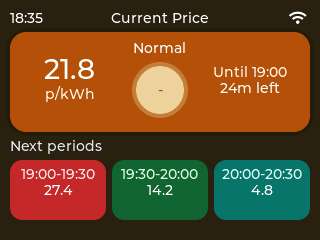
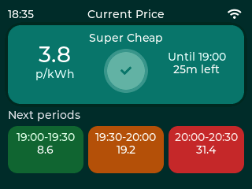
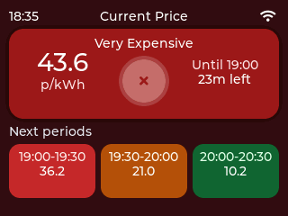
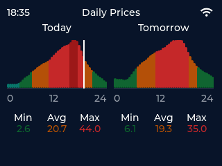

# Greenlight by Ampernomics



Greenlight is a companion project from [Ampernomics](https://ampernomics.com), built around the same goal: helping people understand whether Agile pricing is actually working in their favour.

## What Greenlight Does

- Shows the current Agile unit price in p/kWh.
- Classifies the current slot as Super Cheap, Cheap, Normal, Expensive, or Very Expensive.
- Highlights how long the current period lasts and when the next change happens.
- Previews the next grouped pricing blocks so you can decide whether to run appliances now or later.
- Displays day-level price histograms for today and, when published, tomorrow.
- Supports on-device Wi-Fi setup, brightness control, region selection, and touch calibration.

## Screens

### Primary view

The main screen is optimized for glanceability. It emphasizes the current tariff band, the live unit rate, and the next few grouped periods.





### Detail view

The detail screen shows the full daily shape of Agile pricing so it is easy to spot the best and worst parts of the day.



## Hardware

Greenlight currently supports two build-time Cheap Yellow Display profiles from the same repository:

- `cyd_28_2432s028r`: the original 2.8-inch CYD and the default developer build.
- `ipistbit_32_st7789`: the iPistBit 3.2-inch CYD.

Both targets are ESP32-based boards with integrated Wi-Fi and a 240x320 touchscreen display. The selected build bakes in the matching board profile and OTA board ID through [main/Kconfig.projbuild](main/Kconfig.projbuild) and [main/board_profile.c](main/board_profile.c).

Operationally, the easiest way to tell them apart is the screen size and seller branding:

- `cyd_28_2432s028r`: original 2.8-inch CYD units.
- `ipistbit_32_st7789`: iPistBit-branded 3.2-inch CYD units.

If you are preparing a board for the first time, identify the hardware before flashing. Greenlight must receive the matching board-specific firmware over USB first so the installed image carries the correct board ID, display profile, touch defaults, and OTA compatibility rules from first boot onward.

## Software Stack

- ESP-IDF 6
- LVGL 9
- `esp_lvgl_port`
- `esp_lcd_ili9341`
- `esp_lcd_touch_xpt2046`
- Public Octopus Energy API

The UI is written as a purpose-built embedded interface rather than a mirrored mobile app. Boot, Wi-Fi onboarding, time sync, tariff refresh, and rendering all happen on-device.

## How It Works

On startup, Greenlight:

1. Initializes display, touch, and persistent settings.
2. Reconnects to saved Wi-Fi if credentials are already stored.
3. Synchronizes local time for the `Europe/London` timezone.
4. Downloads the active public Octopus Agile tariff for the selected region.
5. Renders a primary summary screen, a detailed chart screen, and a settings screen.

If pricing cannot be loaded on startup, the device surfaces an offline state instead of pretending stale data is current.

## Current Feature Set

- On-device Wi-Fi scanning and password entry
- Saved Wi-Fi credentials for reconnect after reboot
- Touchscreen calibration stored in NVS
- Adjustable display brightness
- Region selection for Octopus Agile pricing
- Manual OTA firmware update checks and installs from the Settings screen
- Startup splash screen with live status text
- Current and upcoming tariff block summaries
- Today and tomorrow histogram views when data is available
- Graceful handling for partial tomorrow publication from Octopus

## Data Source

Greenlight uses the public Octopus Energy API and currently targets public Agile import pricing by region. It does not require Octopus account authentication for the current firmware flow.

User-facing prices are based on VAT-inclusive unit rates returned by the public tariff endpoints.

## Repository Layout

- [main](main): ESP-IDF application code
- [docs](docs): setup notes and project documentation
- [docs/img](docs/img): README screenshots and documentation images
- [tools](tools): validation, asset generation, and screenshot capture helpers

## Getting Started

For local setup and validation details, see [docs/getting-started.md](docs/getting-started.md).

Minimal firmware build flow:

```sh
idf.py set-target esp32
idf.py build
idf.py -p /dev/ttyUSB0 flash monitor
```

To build an explicit board variant without changing the default workflow, use [docs/getting-started.md](docs/getting-started.md) and run `sh tools/validate.sh firmware cyd_28_2432s028r` or `sh tools/validate.sh firmware ipistbit_32_st7789`.

For first-time device setup over USB, choose the build that matches the physical board:

- 2.8-inch CYD: flash the `cyd_28_2432s028r` build.
- iPistBit 3.2-inch CYD: flash the `ipistbit_32_st7789` build.

That initial USB flash is required before relying on OTA. OTA now selects release assets by the board ID compiled into the running firmware, so a device must already be running the correct board-specific image before Settings can safely install later updates.

The project is developed against ESP-IDF 6.0. The checked-in dev container is the easiest way to get a matching environment.

Tagged releases also publish OTA update artifacts to GitHub Releases so deployed devices can check for and install newer firmware from Settings.

Release artifacts are published with stable board-specific names:

- `firmware-cyd28.bin`: 2.8-inch CYD release image.
- `firmware-ipistbit32.bin`: iPistBit 3.2-inch CYD release image.
- `metadata.json`: OTA manifest containing shared release fields plus per-board entries under `variants`.

OTA is board-aware at runtime. The running device checks `metadata.json`, requires a `variants` object, selects `variants.<board_id>` for its compiled board, and refuses releases when `variants` or the matching board entry is missing. A sample manifest is checked in at [docs/ota-metadata.sample.json](docs/ota-metadata.sample.json).

## Contributing

See [CONTRIBUTING.md](CONTRIBUTING.md) for contribution and validation expectations.

## Notes

Greenlight is an independent project and is not affiliated with Octopus Energy. Octopus Agile and Octopus Energy are trademarks of their respective owners.

Greenlight is maintained by [Ampernomics](https://ampernomics.com).
